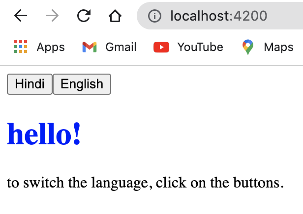
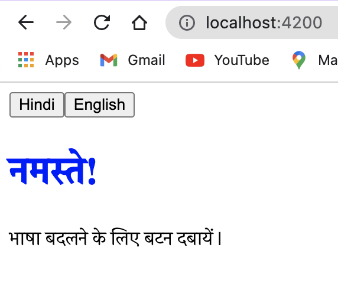

# angular-app

## agenda
to show how to add internationalization (i18n) to your angular application

## setup
**1. install or upgrade node version**

- to install: https://nodejs.org/en/download/


- to check version, run in terminal:

```
node -v  
npm --version
```

- to upgrade, run in terminal:

```
sudo npm cache clean -f
sudo npm install -g n
sudo n stable
```

**2. install angular cli**

```
sudo npm install -g @angular/cli
```

**3. create workspace** 

```
ng new angular-app
cd angular-app
ng serve
```

**4. install ngx-translate**  
since we need the npm modules for translation and for loading translation files through http, run in terminal:  

```
npm i @ngx-translate/core
npm i @ngx-translate/http-loader
```


## setup app module 
1. in app.module.ts, import the following packages to use ngx-translate  

```
import { TranslateModule, TranslateLoader } from "@ngx-translate/core";
import { TranslateHttpLoader } from "@ngx-translate/http-loader";
import { HttpClient } from "@angular/common/http";
```

2. in app.module.ts, create a custom TranslateLoader which needs to be an export function for AoT compilation
```
  export function HttpLoaderFactory(http: HttpClient){
	  return new TranslateHttpLoader(http, './assets/i18n/', '.json');
  }
```

3. in app.module.ts, import TranslateModule in @NgModule with the loader specs as below
```
@NgModule{
imports: [
// ...
HttpClientModule,
TranslateModule.forRoot({
	loader: {
		provide: TranslateLoader,
		useFactory: HttpLoaderFactory,
		deps: [HttpClient]
	}
})
],
// ...
```

## setup app component 

1. in app.component.ts, import TranslateService
```
import { TranslateService } from "@ngx-translate/core";
```

2. add parameter to constructor and set default language to English
```
constructor(private translateService: TranslateService){
	// fallback when translation not found in current lang
	this.translateService.setDefaultLang('en');
	// current language to use
	this.translateService.use('en');
}
```

## how to use 

1. in html, values are pulled using the translate pipe 
so if en.json was
```
{
  "hello": "Hello"
}
```
then can pass key through translate pipe in html elements to get values
```
<h1>{{ 'hello' | translate }}</h1>
```

2. to support multiple translations, can add a function in app.component.ts 
```
changeLanguage(lang: string){
	this.translateService.use(lang);
}
```
and then can add buttons to switch between languages in app.component.html
```
<buttton (click)="changeLanguage('hi')">Hindi</button>
<buttton (click)="changeLanguage('en')">English</button>
```
in this way could support right to left languages like arabic

3. result when english button is clicked


result when hindi button is clicked
